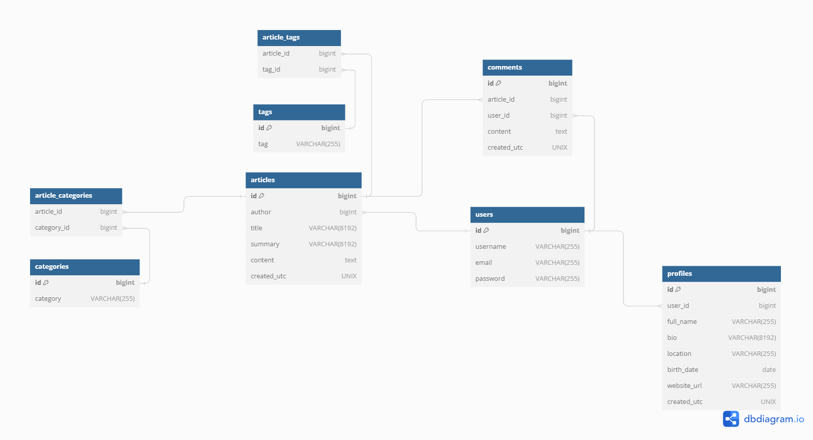

# Microservice application The GitHub Times

 

This backend version of The GitHub Times application only provides a REST API. **There is no UI**.

## Understanding The GitHub Times with a few diagrams

### The GitHub Times ER Model

